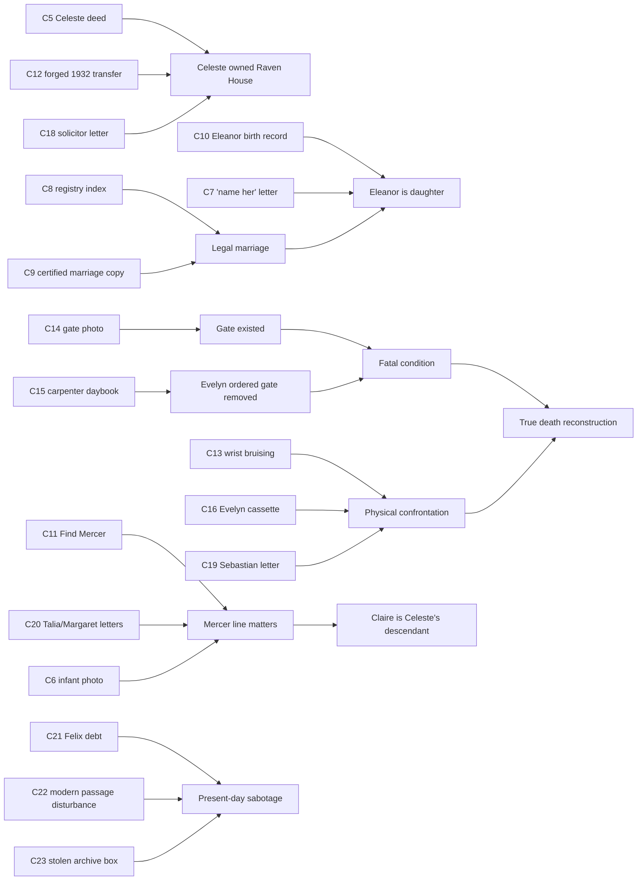

# Clue Map

```mermaid
flowchart LR
    C5["C5 Celeste deed"] --> O["Celeste owned Raven House"]
    C12["C12 forged 1932 transfer"] --> O
    C18["C18 solicitor letter"] --> O
    C8["C8 registry index"] --> M["Legal marriage"]
    C9["C9 certified marriage copy"] --> M
    C10["C10 Eleanor birth record"] --> D["Eleanor is daughter"]
    C7["C7 'name her' letter"] --> D
    M --> D
    C14["C14 gate photo"] --> G["Gate existed"]
    C15["C15 carpenter daybook"] --> GR["Evelyn ordered gate removed"]
    G --> F["Fatal condition"]
    GR --> F
    C13["C13 wrist bruising"] --> X["Physical confrontation"]
    C16["C16 Evelyn cassette"] --> X
    C19["C19 Sebastian letter"] --> X
    F --> T["True death reconstruction"]
    X --> T
    C11["C11 Find Mercer"] --> A["Mercer line matters"]
    C20["C20 Talia/Margaret letters"] --> A
    C6["C6 infant photo"] --> A
    A --> CM["Claire is Celeste's descendant"]
    C21["C21 Felix debt"] --> P["Present-day sabotage"]
    C22["C22 modern passage disturbance"] --> P
    C23["C23 stolen archive box"] --> P
```
