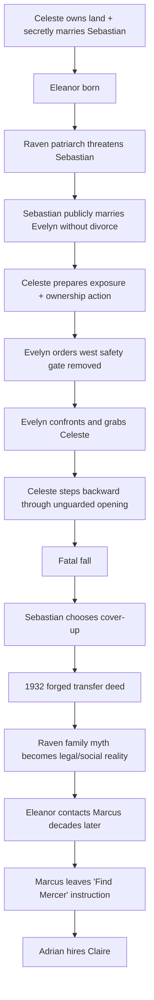

# Historical Causal Chain

```mermaid
flowchart TD
    A["Celeste owns land + secretly marries Sebastian"] --> B["Eleanor born"]
    B --> C["Raven patriarch threatens Sebastian"]
    C --> D["Sebastian publicly marries Evelyn without divorce"]
    D --> E["Celeste prepares exposure + ownership action"]
    E --> F["Evelyn orders west safety gate removed"]
    F --> G["Evelyn confronts and grabs Celeste"]
    G --> H["Celeste steps backward through unguarded opening"]
    H --> I["Fatal fall"]
    I --> J["Sebastian chooses cover-up"]
    J --> K["1932 forged transfer deed"]
    K --> L["Raven family myth becomes legal/social reality"]
    L --> M["Eleanor contacts Marcus decades later"]
    M --> N["Marcus leaves 'Find Mercer' instruction"]
    N --> O["Adrian hires Claire"]
```
