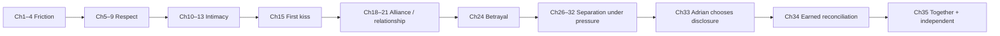

# Romance Map

```mermaid
flowchart LR
    A["Ch1–4 Friction"] --> B["Ch5–9 Respect"]
    B --> C["Ch10–13 Intimacy"]
    C --> D["Ch15 First kiss"]
    D --> E["Ch18–21 Alliance / relationship"]
    E --> F["Ch24 Betrayal"]
    F --> G["Ch26–32 Separation under pressure"]
    G --> H["Ch33 Adrian chooses disclosure"]
    H --> I["Ch34 Earned reconciliation"]
    I --> J["Ch35 Together + independent"]
```
